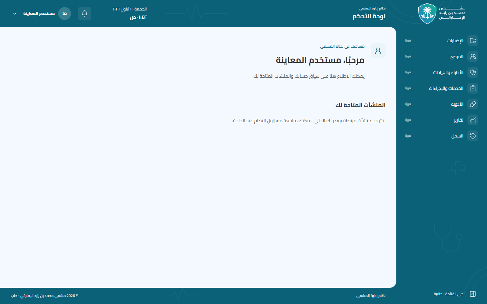
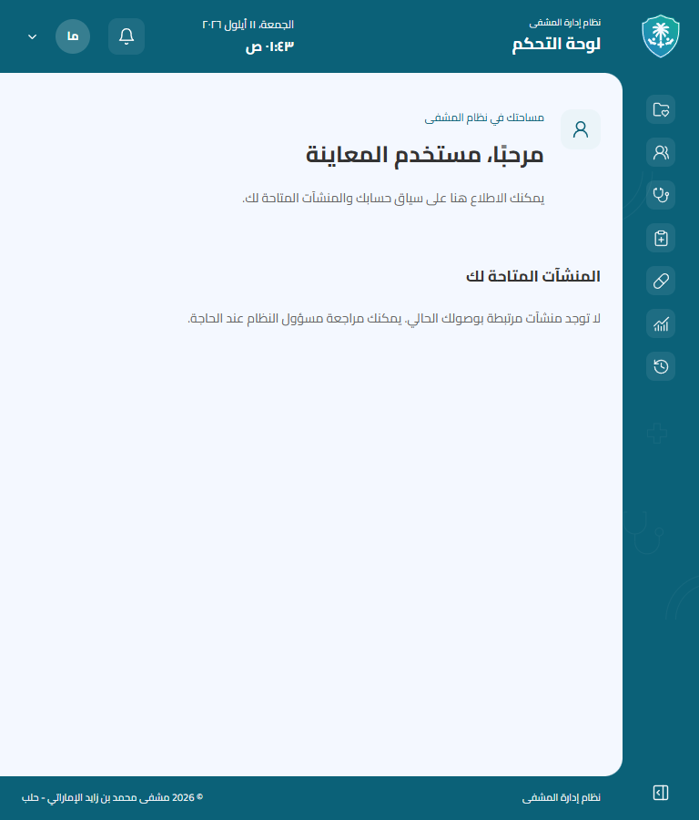
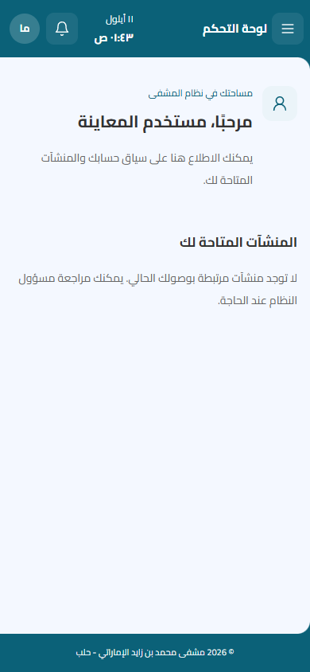
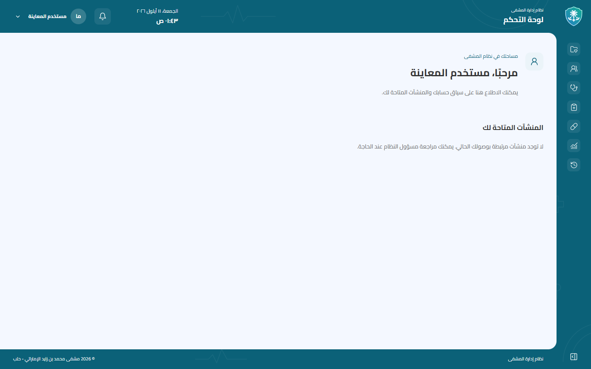
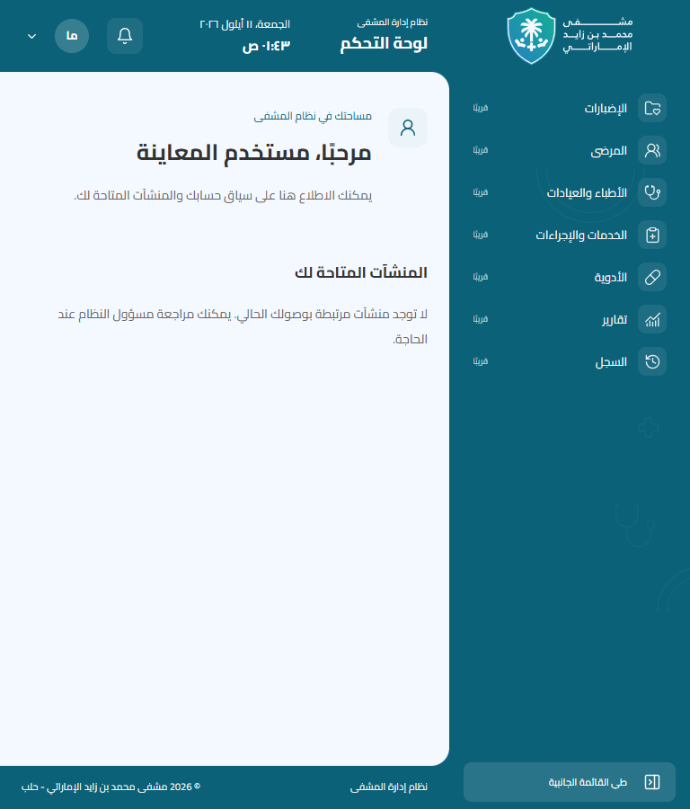
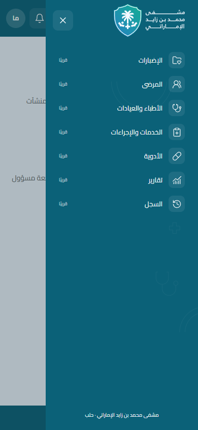
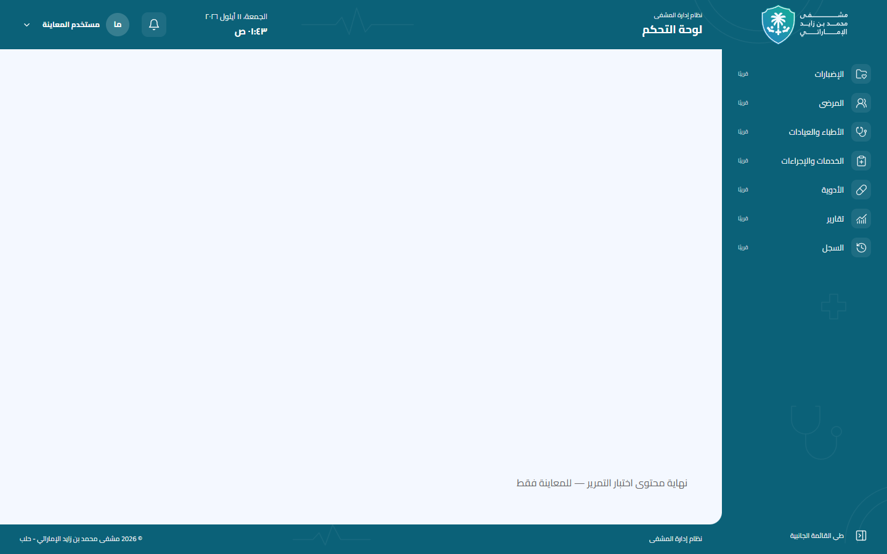

# مراجعة AppShell البصرية

تحسين محدود للواجهة على أساس `develop`، دون تغيير المصادقة أو الداشبورد أو عقود API.
التعديلات محصورة في مكونات layout وSVG محلي واختبار AppShell وهذا التوثيق.

## التنقل والإطار

عناصر التنقل بالترتيب: **الإضبارات، المرضى، الأطباء والعيادات، الخدمات والإجراءات،
الأدوية، تقارير، السجل**. لا صفحات منفذة لهذه العناصر حتى الآن؛ كلها أزرار معطلة
مع «قريبًا» ووصف وصول واسم ثابت في الوضع المطوي. لا روابط وهمية ولا تقسيم إداري.
يبقى الشعار رابطًا إلى `/`، وتبقى آلية اختيار الداشبورد والحساب والخروج كما هي.

`FrameOrnaments` يعرض الرسم المحلي `public/brand/decorations/medical-frame.svg` بعتامة
6% خلف أجزاء الإطار. تشترك الخلفيات في الإحداثيات نفسها باستخدام `background-attachment:
fixed` دون تكرار، فلا يبدأ الرسم من جديد عند التقاء الهيدر والسايدبار. لا توجد زخارف
داخل مساحة الداشبورد أو Login. الطبقة غير تفاعلية ومخفية عن قارئ الشاشة.

يظل الشعار الأصلي 140px والدرع المطوي 42px، مع تلاشي بينهما وخط Cairo المحلي.
حركة العرض والإزاحة متزامنة 250ms مع easing هادئ؛ لا `transition: all`. النص لا يلتف
أثناء الطي، وشبكة التنقل مقيدة بعرض العمود كي تبقى الأيقونات داخله. تقليل الحركة يلغي
الانتقالات. درج الهاتف وTab وEscape وإعادة التركيز وسلوك الفوتر محفوظة.

## التحقق الفعلي

استخدمت نسخة Next.js الإنتاجية محليًا على `127.0.0.1:3101` وEdge/Playwright.
كل بيانات الصور والاختبارات fixtures داخل المتصفح؛ لم يُشغّل Laravel أو اختبار قاعدة
بيانات في هذه المهمة، ولم يُستدعَ API حقيقي. لم تتغير اختبارات المصادقة والداشبورد.

| الفحص | النتيجة |
| --- | --- |
| `node node_modules/typescript/bin/tsc --noEmit` | ناجح |
| `npm run lint` | ناجح |
| `npm run build` | ناجح |
| `TEST_BASE_URL=http://127.0.0.1:3101 PLAYWRIGHT_CHANNEL=msedge node --test tests/app-shell.test.mjs` | 8 اختبارات ناجحة، دون تخطٍ |
| `git diff --check` | ناجح |
| المعاينة | 390 و768 و1440px، قائمة مطوية وموسعة، درج الهاتف وصفحة طويلة |

الاختبارات تتحقق من أسماء التنقل وترتيبه وتعطيله، رابط الشعار، اتصال الحواف واحتواء
الأيقونات وعدم التمرير الأفقي خلال إطارات الحركة، تقليل الحركة، الساعة، لوحة المفاتيح،
المحتوى الطويل والعريض والحساب والخروج باستخدام استجابات اختبارية. لا اختبارات جديدة
لمجرد نسخ قيم CSS. نطاق المتصفح المجرب Edge؛ لم تُفحص أجهزة Safari/iOS فعلية.

تعذر اعتماد تسجيل نهائي للحركة بسبب رفض إذن إعادة تشغيل أداة الالتقاط خارج العزل
للوصول إلى FFmpeg. الصور واختبارات الحركة داخل المتصفح مكتملة.

## الصور

| Desktop 1440px | Tablet 768px | Mobile 390px |
| --- | --- | --- |
|  |  |  |

| القائمة المطوية | Tablet موسع | درج الهاتف |
| --- | --- | --- |
|  |  |  |

