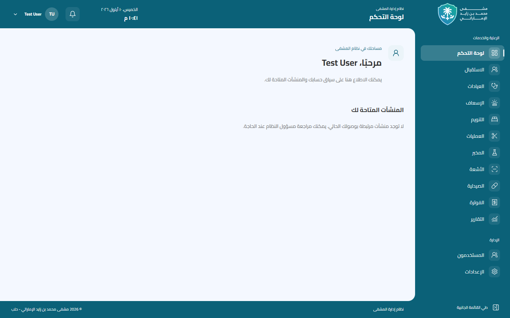
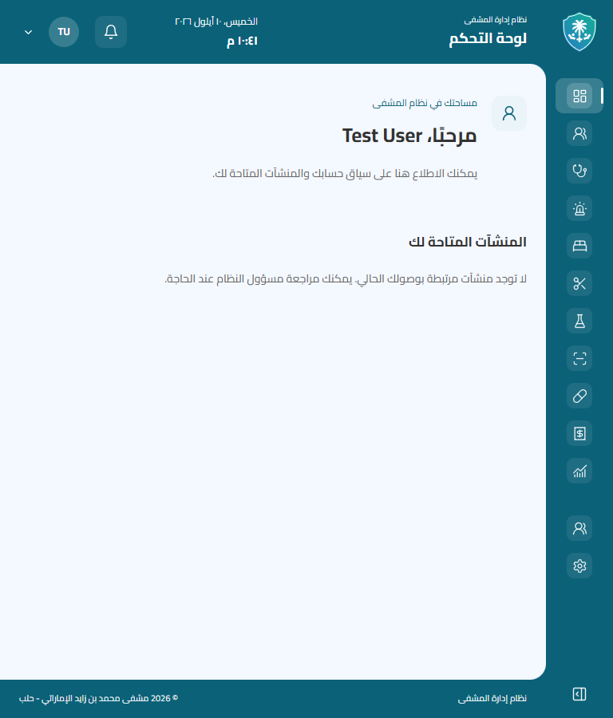
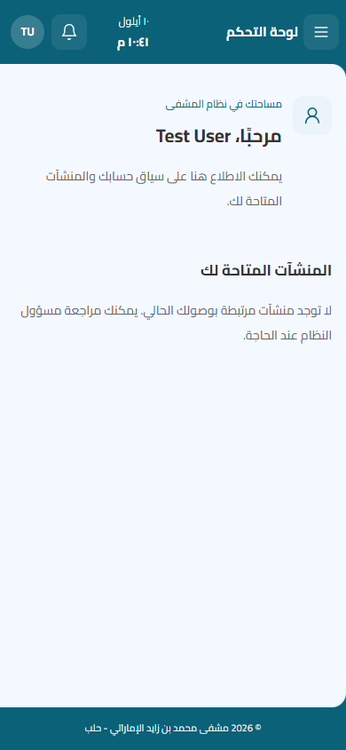

# Application Shell and dashboards

تستخدم الصفحات الداخلية مجموعة `(hospital)` وغلاف مصادقة واحدًا وAppShell مشتركًا.
Laravel يقرر لوحات التحكم المسموحة وبياناتها؛ FastAPI لا يشارك في ذلك.
راجع [عقد API وسياسة الوصول وإعداد النشر](../../backend/docs/dashboards-api.md).

## الدخول والتنقل

- بعد الدخول يوجّه `router.replace` إلى `/`، حيث يُتحقق من المستخدم ويُطلب كتالوج
  الداشبوردات ثم يُستبدل الرابط بالافتراضي المسموح، حاليًا `/dashboard/general`.
- الرابط المباشر وإعادة التحميل يعيدان التحقق قبل عرض البيانات. يبقى `/login` خارج
  الغلاف، وتصميمه وأصول شعاره وخط Cairo المحلي محفوظة.
- المفاتيح في `features/dashboards/registry.ts` مربوطة بمكونات ومسارات محلية فقط.
  لا يُستخدم `next` أو `returnTo` أو URL من API للتحويل.
- اللوحة العامة تعرض اسم المستخدم ومنشآته الفعلية، دون إحصاءات أو روابط لوحدات غير
  منفذة. الحساب بلا منشآت يرى حالة فارغة واضحة. لا قائمة تبديل عند توفر لوحة واحدة.
- فشل الشبكة و403 و404 وعدم توفر لوحة لها حالات واضحة مع إعادة المحاولة؛ رفض لوحة
  وحده لا يسجل خروج المستخدم. 401 أو ACCOUNT_INACTIVE يمحو التوكن ويزيل السياق المحمي.
- عند تغير التوكن يعاد إنشاء شجرة المصادقة. تغير المفتاح أو المنشأة يزيل بيانات الطلب
  السابق ويلغيه؛ الاستجابة المتأخرة لا تستطيع عرض سياق سابق أو مسح جلسة أحدث.

## الإطار البصري

- Sidebar يمين بعرض 268px وارتفاع `100dvh`؛ Tablet ‏768–1279px يبدأ بعرض 84px قابل
  للتوسيع. التمرير محصور في التنقل؛ Brand Corner ثابتة أعلى القائمة.
- الهيدر والسايدبار والفوتر وزاوية الشعار تشترك في اللون `--mbz-action` ‏#0B6178.
  لا تدرجات متكررة أو حدود أو فجوات أو ظلال بين أجزاء الإطار. مساحة المحتوى بلون
  `--mbz-surface` ‏#F4F8FF، بانحناء داخلي يمين 20px (16px على الهاتف).
- الشعار الأبيض الرسمي بعرض 140px وبنسبه الأصلية في القائمة المفتوحة والدرج، والدرع
  الأبيض المستقل بعرض 42px في الوضع المطوي. لا إعادة رسم أو تعديل على أصول SVG.
- التنقل محصور بالترتيب: الإضبارات، المرضى، الأطباء والعيادات، الخدمات والإجراءات،
  الأدوية، تقارير، السجل. كلها غير منفذة حاليًا، فتظهر معطلة مع «قريبًا» ووصف وصول؛
  الشعار وحده يعيد إلى نقطة دخول الداشبورد، ولا يوجد تقسيم إداري إضافي.
- زخارف طبية SVG محلية بعتامة 6% تشترك في إحداثيات نافذة واحدة عبر أجزاء الإطار.
  طبقتها خلف المحتوى، `aria-hidden` و`pointer-events: none`، ولا تدخل مساحة الداشبورد أو Login.
- عرض القائمة وإزاحة مساحة العمل يتحركان معًا خلال 250ms؛ النصوص تتلاشى دون التفاف
  والأيقونات تبقى ثابتة الحجم. `prefers-reduced-motion` يلغي الانتقالات.
- النص والعنوان والساعة وأيقونات الإطار بيضاء؛ التاريخ والنص الثانوي أبيضان 94%.
  أيقونات التنقل 19px بسماكة 1.7 داخل حاويات 32px. Hover أبيض 12%، والعنصر الحالي
  18% مع مؤشر يمين صغير. التركيز أبيض على الإطار وعميق على قائمة الحساب البيضاء.
- الهيدر sticky بارتفاع 80px (72px للهاتف)، والفوتر في تدفق المستند بارتفاع أدنى
  48px: أسفل الشاشة للمحتوى القصير وبعد المحتوى الطويل. المحتوى العريض يمرر داخل canvas.
- درج الهاتف أصلي باستخدام `dialog.showModal()`؛ يدعم Tab وEscape والخلفية وإعادة
  التركيز وإغلاقه عند الانتقال إلى Desktop. يمنع تمرير الخلفية وهو مفتوح.
- Cairo محفوظ في `public/fonts/cairo` ويُحمّل محليًا. `HeaderDateTime` يستخدم `ar-SY`
  و`Asia/Damascus` كل 30 ثانية دون hydration mismatch. التاريخ مختصر على الهاتف،
  والساعة فقط أقل من 360px. الحركة اللونية 180ms وتُلغى مع reduced motion.

## تنظيم الملفات

| المسار | المسؤولية |
| --- | --- |
| `src/app/(hospital)/layout.tsx` | الغلاف المشترك |
| `src/app/(hospital)/page.tsx` | اختيار الافتراضي المسموح |
| `src/app/(hospital)/dashboard/[key]/page.tsx` | صفحة قابلة للتوسع حسب المفتاح |
| `src/features/auth/AuthenticatedLayout.tsx` | التحقق من الهوية وإزالة سياق الجلسة السابقة |
| `src/features/auth/api.ts` | Bearer والنقل الحالي وإلغاء الطلبات وحماية تبديل الجلسة |
| `src/features/dashboards/` | عقد الواجهة وسجل المكونات وحالات العرض واللوحة العامة |
| `src/components/layout/` | الهيكل والساعة والدرج والتنقل والحساب |
| `next.config.ts` | proxy محدد إلى Laravel، بما فيه مسارا dashboards |

عناصر التنقل غير المنفذة والتنبيهات تبقى معطلة بأسماء وصول واضحة. لا أدوار
مختلقة أو صلاحيات مبنية على أسماء الأدوار. مستقبلًا يضاف تعريف Laravel ومكون محلي
واختبارات وصول؛ لا حاجة إلى نسخ الهيدر أو السايدبار أو الفوتر.

## التحقق والصور

اختبارات `tests/app-shell.test.mjs` و`tests/dashboards.test.mjs` تغطي المقاسات الستة
320/390/768/1024/1440/1920، هندسة الإطار، Tab/Escape، المحتوى الطويل والعريض، الساعة،
رفض الوصول والشبكة، الاستجابات المتأخرة، تبديل المستخدم والمنشأة، وعدم وجود open redirect.
اختبارات `tests/auth-ui.test.mjs` تحتفظ بتغطية الدخول وتضيف التحويل الحقيقي للداشبورد
وإعادة تحميله وفتحه مباشرة والخروج ورفض التوكن الملغى.

نتيجة فحص أساس الداشبورد السابق: TypeScript وLint وBuild ناجحة؛ 23 اختبار متصفح ناجحًا، دون تخطٍ،
على نسخة الإنتاج المحلية `127.0.0.1:3101` باستخدام Edge/Playwright. أداة المتصفح المدمج
متعذرة بسبب إعداد sandboxPolicy؛ استخدم الفحص Edge المثبت. فُحص Laravel على
mysql / hospital_testing / 127.0.0.1:13306 بعد `test-db:check` فقط، دون اتصال بالإنتاج.

الصور التالية لحساب Test User الموجود في MySQL الاختبارية؛ لا بيانات إنتاجية:

| Desktop 1440×900 | Tablet 768×900 | Mobile 390×844 |
| --- | --- | --- |
|  |  |  |

[درج الهاتف والشعار المصغر](screenshots/dashboard-mobile-drawer.png).

صور ونتائج التحسين البصري الحالي موجودة في [مراجعة AppShell البصرية](app-shell-visual-refinement.md).
