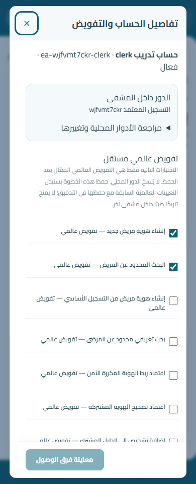
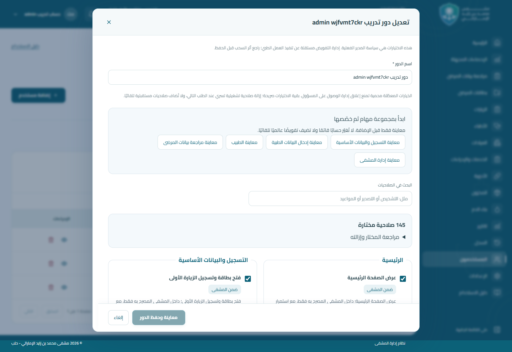

# مراجعة إدارة الصلاحيات والتسجيل

تستخدم الشاشات جدول وإجراءات وحوار الدليل المشترك وRTL وCairo المحلي. تفاصيل الدور تظهر لحساب `roles.view` وحده؛ لا يحتاج قراءة حسابات المستخدمين. محرر المدير يبيّن الحد المحمي والمعنى الفعلي لإزالة الصلاحية. تفاصيل الحساب تفصل ملخص الدور المحلي القابل للبحث عن التفويض العالمي، مع معاينة الفرق وسبب قبل الحفظ.

الدليل المصوّر يوضح تسلسل مسؤول النظام ← دور مدخل البيانات ← مهام التسجيل ← إسناد الدور محليًا ← التفويض العالمي الصريح ← البحث ← البطاقة. تظل البيانات الطبية محجوبة عن حساب التسجيل المحدود.

## لقطات التطبيق الفعلي

بيانات اصطناعية على Next standalone وLaravel وMariaDB محليين؛ ليست صور تصميم ولا بيانات المشفى. راجعت التمرير داخل الحوارات، ترتيب RTL، بقاء أزرار الإجراءات ظاهرة، البحث في الأدوار الطويلة، وعدم التمرير الأفقي. أُخذت الصور عند عروض 390 و768 و1440px.

| الشاشة | 390px | 768px | 1440px |
| --- | --- | --- | --- |
| محرر الدور المحمي | [هاتف](images/explicit-access/protected-390.png) | [لوحي](images/explicit-access/protected-768.png) | [سطح مكتب](images/explicit-access/protected-1440.png) |
| الإسناد المحلي والعالمي | [هاتف](images/explicit-access/account-390.png) | [لوحي](images/explicit-access/account-768.png) | [سطح مكتب](images/explicit-access/account-1440.png) |
| المثال المصوّر | [هاتف](images/explicit-access/guide-390.png) | [لوحي](images/explicit-access/guide-768.png) | [سطح مكتب](images/explicit-access/guide-1440.png) |

## التحقق

التشغيل الموسع قبل تثبيت الإصدار: 148 اختبار Laravel / 6523 تحققًا، بلا فشل أو تخطٍ. التشغيل المجمع للواجهة: 18 حالة / صفر فشل أو تخطٍ (14 تكاملًا حقيقيًا و4 محاكاة لواجهة المستخدمين). يعاد تشغيل المجموعات نفسها على SHA النهائي وتُسجل النتيجة المرتبطة به في PR.

الاختبار الحقيقي الجديد `tests/explicit-access-live.test.mjs` يغيّر دورًا من المحرر، ثم يسند الدور محليًا، ويتحقق أن البحث العالمي ما زال مرفوضًا، ثم يفعّل التفويض المحدد من تفاصيل الحساب ويحفظ بطاقة وزيارة أولى ويعيد فتحها. يتحقق من رفض التاريخ الطبي والتصدير والحذف، وحساب عرض الأدوار فقط، والشاشات عند العروض الثلاثة. لا يستخدم اعتراضات API أو `page.route`.

`tests/unified-registration-live.test.mjs` يعيد فحص المجموعة السابقة كاملة، بما فيها متطلب تصحيح الجلسة لإلغاء إعطاء الجرعة. `tests/users.test.mjs` يختبر سلوك واجهة المستخدمين بالمحاكاة، ولا يُستخدم بديلًا لإثبات التحويلات.

قاعدة التحقق: MariaDB 10.11.18، driver `mysql`، قاعدة `blood_bank_cities_testing` على `127.0.0.1:13416`. اجتاز حاجز الأمان وأُضيف الترحيل دون إعادة تهيئة. اختبارات Laravel تستخدم `tests/Support/preserve-database.php` ومعاملات التراجع؛ لا `migrate:fresh` ولا SQLite. بيانات التكامل الاصطناعية وتدقيقها محفوظة وتُعطّل حساباتها وتُسحب رموزها بعد الاختبار.

OpenAPI: تصدير بـ`--env=testing` وذاكرة CLI مؤقتة 512MB بعد تجاوز حد 128MB؛ المسارات الجديدة موجودة. تبقى 11 ملاحظة استدلال من Scramble على الموارد القائمة غير المعدلة. المحاولة الأولى دون تحديد بيئة الاختبار حملت `.env` المحلي واستُهدف `127.0.0.1:3306/admin_his`، لكن الاتصال رُفض؛ لم ينجح اتصال أو تعديل بيانات. جميع تشغيلات التكامل والاختبارات والترحيل استخدمت قاعدة الاختبار المحروسة.

لا يدّعي هذا التحقق تشغيلًا على قاعدة المشفى أو فحص كامل المشروع غير المتأثر. لم يُعد ضبط قاعدة مأهولة، ولم يُنفّذ تفعيل الوصول على الإنتاج أو دمج أو نشر.

[تعليمات التفعيل والمعاينة والحماية من التراجع](../../backend/docs/explicit-access-administration.md).
