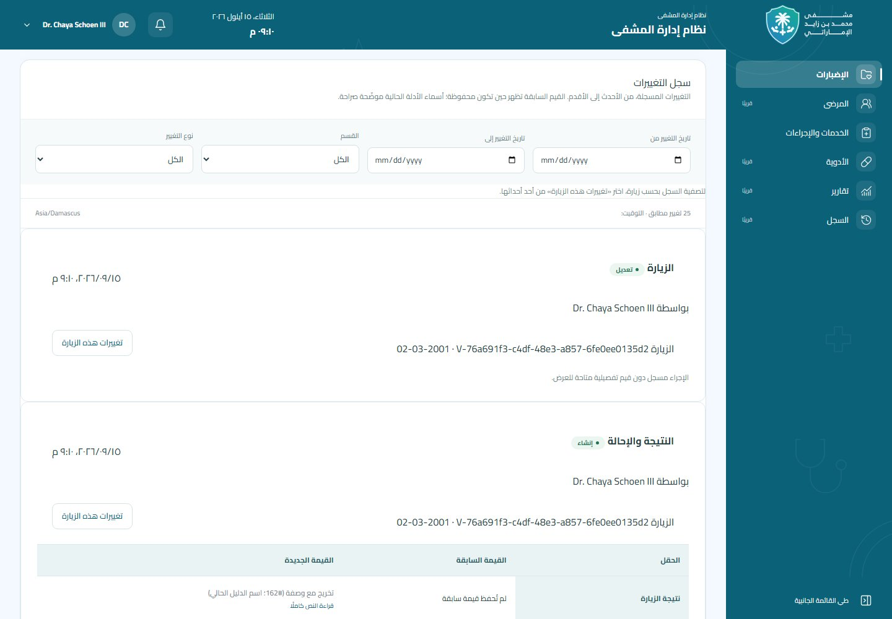

# مراجعة المرحلة الرابعة — الإضبارات

بيانات اصطناعية فقط. اللقطات مأخوذة من Chromium عبر Next.js 16.3.4 standalone وLaravel الفعليين مع MariaDB 10.11.18 اختبارية. لا توجد استجابات API محاكية أو `page.route` في هذا التحقق.

| العرض | الصفحة كاملة | منطقة سجل التغييرات |
| --- | --- | --- |
| 390px | [الهاتف](history-390.jpg) | [السجل على الهاتف](history-390-viewport.jpg) |
| 768px | [الجهاز اللوحي](history-768.jpg) | [السجل على الجهاز اللوحي](history-768-viewport.jpg) |
| 1440px | [سطح المكتب](history-1440.jpg) | [السجل على سطح المكتب](history-1440-viewport.jpg) |

يستخدم جدول القيم التمرير الأفقي الداخلي المشترك عند الحاجة على الهاتف. اختُبر عدم تجاوز عرض الصفحة ومساحة المحتوى عند الأحجام الثلاثة. يبقى المعالج وتصميم AppShell كما هما؛ رابط السجل يصل إلى عنوانه أسفل الهيدر الثابت.



## عينة التاريخ الكامل

- [PDF الفعلي](full-history.pdf)
- [Excel الفعلي](full-history.xlsx)
- صفحات PDF المعروضة باستخدام PDF.js 6.3.289: [1](print/full-history-1.jpg)، [2](print/full-history-2.jpg)، [3](print/full-history-3.jpg).

المدة في العينة هي تاريخ الزيارة الفعلي `2001-03-02`. تتضمن خدمة أُلغيت مع سببها، ووصفة مستقلة عن الصرف. كل الأسماء والأكواد اصطناعية، ولا يوجد ملف مرفق أو مفتاح تخزين خاص داخل التقريرين.

أعيد فتح Excel باستخدام PhpSpreadsheet: 12 ورقة اجتازت خصائص A4/RTL/Cairo، نطاق الطباعة، الرؤوس المتكررة والتجميد والفلاتر والهوامش، وأنواع الخلايا وحماية الصيغ ووجود سبب الإلغاء. الأمر القابل لإعادة التشغيل، دون اتصال بقاعدة بيانات:

```bash
cd backend
php tests/Support/verify-dossier-history-workbook.php
```

فُحصت صفحات PDF الثلاث بصريًا؛ لم يظهر قص أو تداخل أو صفحة فائضة فارغة في هذه العينة، ويتكرر رأس الجدول عند الاستكمال. تأكد تضمين Cairo Regular/Bold من كائنات الخط المضغوطة. **LibreOffice غير متاح**؛ صور PDF هنا من تقرير الخادم وليست تحويلًا أو معاينة طباعة لملف Excel، ولا يُدّعى إجراء ذلك الفحص.

نتائج اختبارات الخادم والتكامل وأوامر التشغيل وحدود المرحلة موثقة في [توثيق المرحلة الرابعة](../../../../backend/docs/patient-dossiers-phase-four.md).
