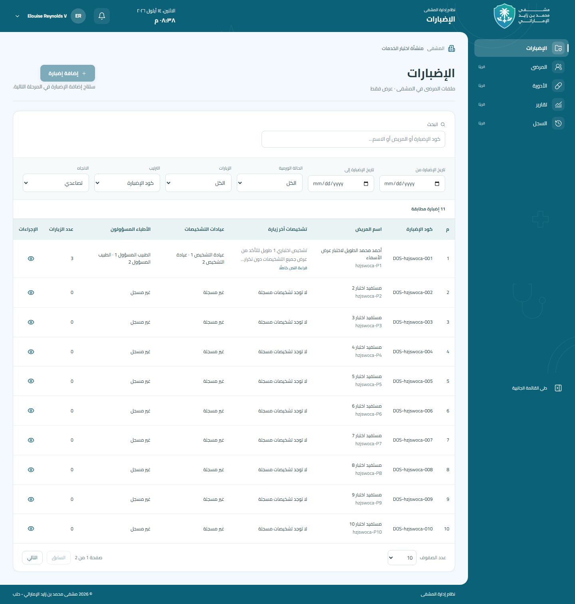

# مراجعة الإضبارات — المرحلة الأولى

لقطات فعلية ببيانات اصطناعية من Chromium، Next standalone → Laravel → MariaDB 10.11.
التحميل/الفشل يؤخّران تسليم استجابة Laravel الفعلية أو يفشلان النقل بعدها؛ لا page.route ولا API محاكٍ.
يستخدم الجدول التمرير الأفقي الداخلي المشترك على الهاتف؛ صور list-actions تظهر الأعمدة والإجراءات بعد التمرير.

## 390px

- [list](list-390.jpg)
- [list-actions](list-actions-390.jpg)
- [oncology-detail](oncology-detail-390.jpg)
- [previous-visit](previous-visit-390.jpg)
- [empty](empty-390.jpg)
- [no-visits](no-visits-390.jpg)
- [loading](loading-390.jpg)
- [error](error-390.jpg)

## 768px

- [list](list-768.jpg)
- [list-actions](list-actions-768.jpg)
- [oncology-detail](oncology-detail-768.jpg)
- [previous-visit](previous-visit-768.jpg)
- [empty](empty-768.jpg)
- [no-visits](no-visits-768.jpg)
- [loading](loading-768.jpg)
- [error](error-768.jpg)

## 1440px

- [list](list-1440.jpg)
- [list-actions](list-actions-1440.jpg)
- [oncology-detail](oncology-detail-1440.jpg)
- [previous-visit](previous-visit-1440.jpg)
- [empty](empty-1440.jpg)
- [no-visits](no-visits-1440.jpg)
- [loading](loading-1440.jpg)
- [error](error-1440.jpg)

