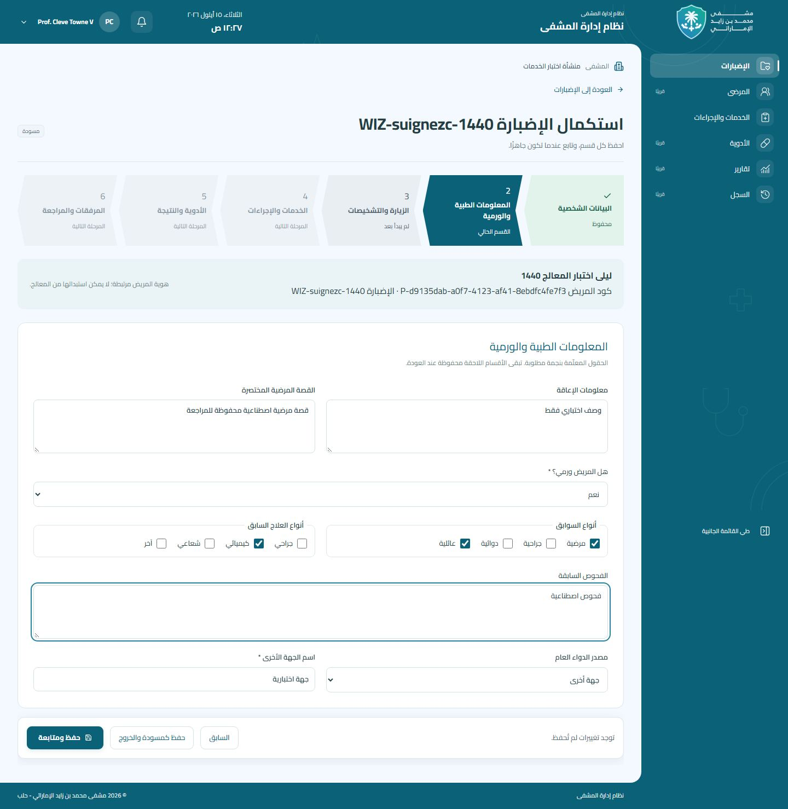
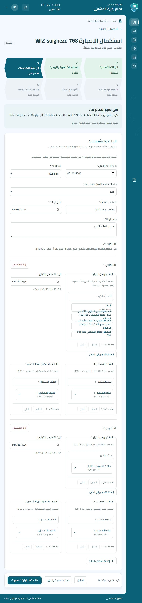
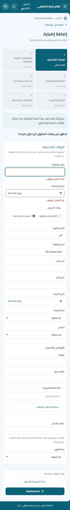

# معرض مراجعة الإضبارات — المرحلة الثانية

لقطات فعلية ببيانات اصطناعية من Chromium عبر Playwright، باستخدام بناء Next.js standalone ومسار Next → Laravel → MariaDB 10.11.18 المحلي المعزول. ليست صور تصميم أو استجابات API محاكية. جميع الملفات أدناه محفوظة داخل المستودع للمراجعة من GitHub.

تمت مراجعة RTL وخط Cairo المحلي وتوزيع الحقول ومسار التقدم وأخطاء التحقق. الاختبار يفحص عدم وجود تمرير أفقي على مستوى الصفحة في كل لقطة، والحفظ والاستئناف والتشخيصات والتعارضات عبر الخادم الحقيقي، وينتظر اكتمال تحميل الخيارات قبل الالتقاط.

| الحالة | هاتف 390px | لوحي 768px | سطح مكتب 1440px |
| --- | --- | --- | --- |
| قبل أول حفظ | [عرض](empty-390.jpg) | [عرض](empty-768.jpg) | [عرض](empty-1440.jpg) |
| اختيار مريض موجود | [عرض](existing-patient-390.jpg) | [عرض](existing-patient-768.jpg) | [عرض](existing-patient-1440.jpg) |
| بيانات مريض جديد | [عرض](new-patient-390.jpg) | [عرض](new-patient-768.jpg) | [عرض](new-patient-1440.jpg) |
| أخطاء القسم الشخصي والتركيز | [عرض](personal-errors-390.jpg) | [عرض](personal-errors-768.jpg) | [عرض](personal-errors-1440.jpg) |
| بيانات طبية غير ورمية | [عرض](medical-general-390.jpg) | [عرض](medical-general-768.jpg) | [عرض](medical-general-1440.jpg) |
| الملف الورمي والاختيارات المتعددة | [عرض](oncology-390.jpg) | [عرض](oncology-768.jpg) | [عرض](oncology-1440.jpg) |
| التحقق من اسم الجهة الأخرى | [عرض](oncology-errors-390.jpg) | [عرض](oncology-errors-768.jpg) | [عرض](oncology-errors-1440.jpg) |
| إحالة الزيارة | [عرض](referral-390.jpg) | [عرض](referral-768.jpg) | [عرض](referral-1440.jpg) |
| تشخيصان بعيادتين وطبيبين مستقلين | [عرض](multiple-diagnoses-390.jpg) | [عرض](multiple-diagnoses-768.jpg) | [عرض](multiple-diagnoses-1440.jpg) |
| إضافة تشخيص من الحوار المشترك | [عرض](inline-diagnosis-390.jpg) | [عرض](inline-diagnosis-768.jpg) | [عرض](inline-diagnosis-1440.jpg) |
| بعد حفظ الزيارة كمسودة | [عرض](saved-390.jpg) | [عرض](saved-768.jpg) | [عرض](saved-1440.jpg) |
| استئناف المسودة المحفوظة | [عرض](resumed-390.jpg) | [عرض](resumed-768.jpg) | [عرض](resumed-1440.jpg) |
| تعارض النسخة مع بقاء المسودة | [عرض](conflict-390.jpg) | [عرض](conflict-768.jpg) | [عرض](conflict-1440.jpg) |

## معاينة

إعادة الالتقاط: `node --test tests/dossier-workflow-live.test.mjs` وفق [تعليمات بيئة الاختبار والحماية](../../../../backend/docs/patient-dossiers-phase-two.md). لا تستخدم بيانات مرضى حقيقية. خطوات الخدمات والأدوية والمرفقات معطلة ولا ترسل طلبات كتابة؛ لا تفعيل نهائي للإضبارة ولا إكمال نهائي للزيارة في هذه المرحلة.
