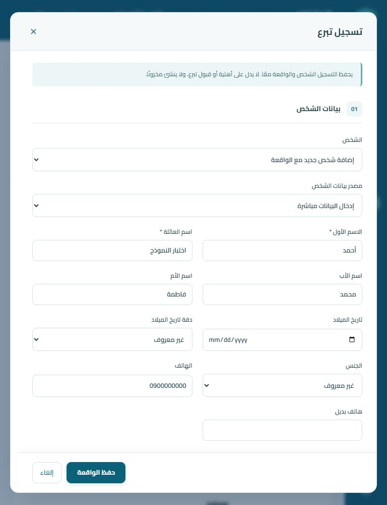
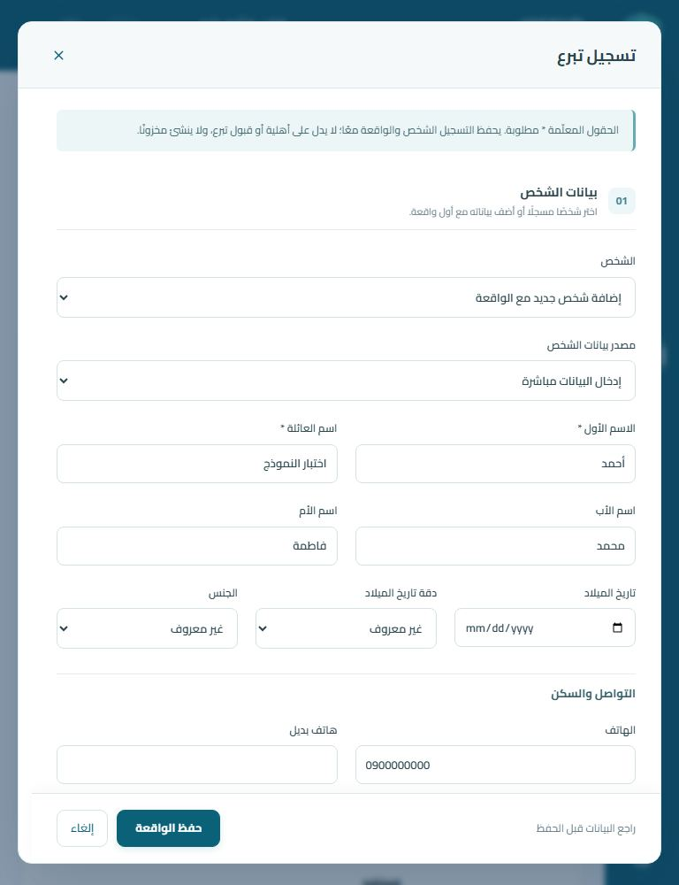
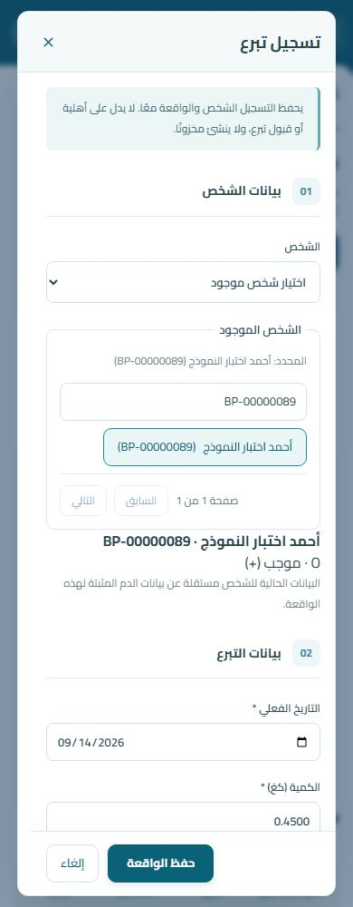
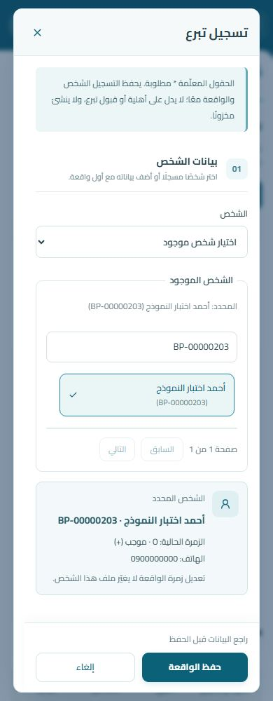
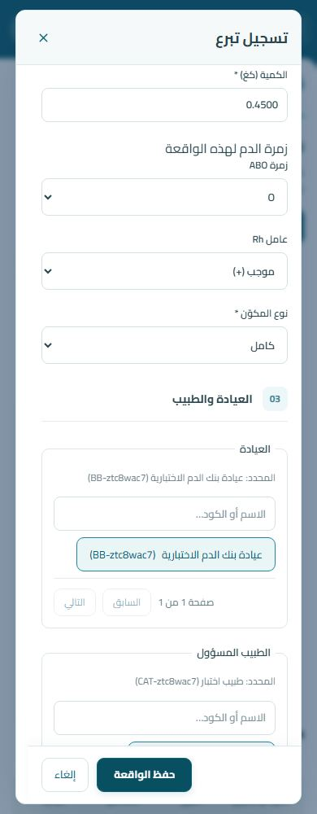
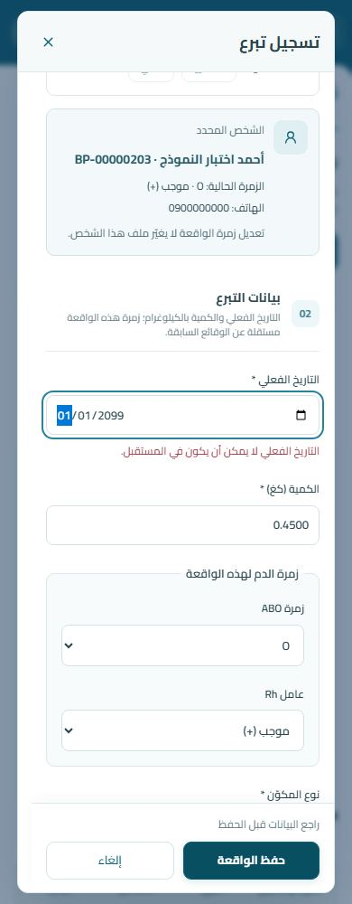
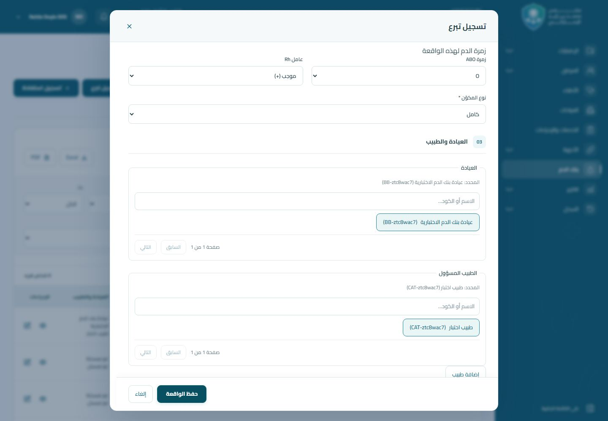
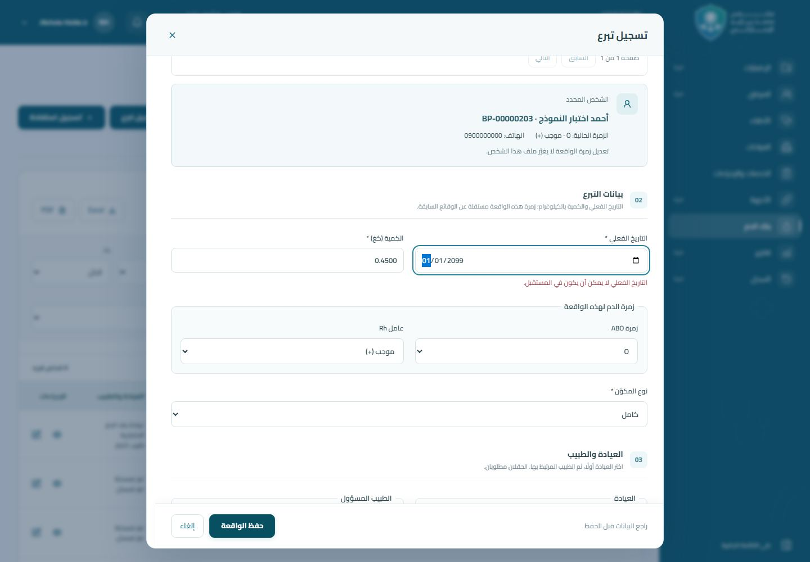

# مقارنة نماذج بنك الدم — PR #19

لقطات فعلية من Chromium عبر Next standalone → Laravel → MariaDB 10.11.18، ببيانات اصطناعية فقط، عند 390 و768 و1440px وارتفاع شاشة 1000px. «قبل» من SHA 62a7d0706686cf55987c3bb0b0609a08ec665b75، و«بعد» من بناء هذا التحديث.

كل رابط مرقّم يمثل موضع تمرير حقيقيًا داخل الحوار من أعلاه حتى نهايته، مع تداخل بين الصور لعدم إسقاط الحقول. لم يُوسّع الحوار اصطناعيًا ولم تُلصق الصور أو تُعدّل محتوياتها. ملفات «خطأ» التُقطت بعد رفض Laravel تاريخًا مستقبليًا، وتُظهر موضع التركيز بعد الفشل. قد تختلف الأكواد الاصطناعية بين التشغيلين. اضغط الصورة أو رابط الجزء لعرضه بالحجم الأصلي.

## معاينة المقارنة

| النموذج | قبل | بعد |
| --- | --- | --- |
| الهوية وتوزيع الحقول — 768px |  |  |
| ملخص الشخص — 390px |  |  |
| فشل التحقق — 390px |  |  |
| فشل التحقق — 1440px |  |  |

## النماذج كاملة

### شخص جديد وتبرع

| العرض | قبل، من أعلى الحوار لأسفله | بعد، من أعلى الحوار لأسفله |
| --- | --- | --- |
| 390px | [جزء 1](before/new-donation-390-1.jpg) · [جزء 2](before/new-donation-390-2.jpg) · [جزء 3](before/new-donation-390-3.jpg) · [جزء 4](before/new-donation-390-4.jpg) · [جزء 5](before/new-donation-390-5.jpg) · [خطأ التحقق](before/new-donation-390-error.jpg) | [جزء 1](after/new-donation-390-1.jpg) · [جزء 2](after/new-donation-390-2.jpg) · [جزء 3](after/new-donation-390-3.jpg) · [جزء 4](after/new-donation-390-4.jpg) · [جزء 5](after/new-donation-390-5.jpg) · [خطأ التحقق](after/new-donation-390-error.jpg) |
| 768px | [جزء 1](before/new-donation-768-1.jpg) · [جزء 2](before/new-donation-768-2.jpg) · [جزء 3](before/new-donation-768-3.jpg) · [جزء 4](before/new-donation-768-4.jpg) · [خطأ التحقق](before/new-donation-768-error.jpg) | [جزء 1](after/new-donation-768-1.jpg) · [جزء 2](after/new-donation-768-2.jpg) · [جزء 3](after/new-donation-768-3.jpg) · [جزء 4](after/new-donation-768-4.jpg) · [خطأ التحقق](after/new-donation-768-error.jpg) |
| 1440px | [جزء 1](before/new-donation-1440-1.jpg) · [جزء 2](before/new-donation-1440-2.jpg) · [جزء 3](before/new-donation-1440-3.jpg) · [جزء 4](before/new-donation-1440-4.jpg) · [خطأ التحقق](before/new-donation-1440-error.jpg) | [جزء 1](after/new-donation-1440-1.jpg) · [جزء 2](after/new-donation-1440-2.jpg) · [جزء 3](after/new-donation-1440-3.jpg) · [جزء 4](after/new-donation-1440-4.jpg) · [خطأ التحقق](after/new-donation-1440-error.jpg) |

### شخص موجود وتبرع

| العرض | قبل، من أعلى الحوار لأسفله | بعد، من أعلى الحوار لأسفله |
| --- | --- | --- |
| 390px | [جزء 1](before/existing-donation-390-1.jpg) · [جزء 2](before/existing-donation-390-2.jpg) · [جزء 3](before/existing-donation-390-3.jpg) · [خطأ التحقق](before/existing-donation-390-error.jpg) | [جزء 1](after/existing-donation-390-1.jpg) · [جزء 2](after/existing-donation-390-2.jpg) · [جزء 3](after/existing-donation-390-3.jpg) · [جزء 4](after/existing-donation-390-4.jpg) · [خطأ التحقق](after/existing-donation-390-error.jpg) |
| 768px | [جزء 1](before/existing-donation-768-1.jpg) · [جزء 2](before/existing-donation-768-2.jpg) · [جزء 3](before/existing-donation-768-3.jpg) · [خطأ التحقق](before/existing-donation-768-error.jpg) | [جزء 1](after/existing-donation-768-1.jpg) · [جزء 2](after/existing-donation-768-2.jpg) · [جزء 3](after/existing-donation-768-3.jpg) · [خطأ التحقق](after/existing-donation-768-error.jpg) |
| 1440px | [جزء 1](before/existing-donation-1440-1.jpg) · [جزء 2](before/existing-donation-1440-2.jpg) · [جزء 3](before/existing-donation-1440-3.jpg) · [خطأ التحقق](before/existing-donation-1440-error.jpg) | [جزء 1](after/existing-donation-1440-1.jpg) · [جزء 2](after/existing-donation-1440-2.jpg) · [جزء 3](after/existing-donation-1440-3.jpg) · [خطأ التحقق](after/existing-donation-1440-error.jpg) |

### شخص جديد وصرف مكوّن

| العرض | قبل، من أعلى الحوار لأسفله | بعد، من أعلى الحوار لأسفله |
| --- | --- | --- |
| 390px | [جزء 1](before/new-issue-390-1.jpg) · [جزء 2](before/new-issue-390-2.jpg) · [جزء 3](before/new-issue-390-3.jpg) · [جزء 4](before/new-issue-390-4.jpg) · [جزء 5](before/new-issue-390-5.jpg) · [خطأ التحقق](before/new-issue-390-error.jpg) | [جزء 1](after/new-issue-390-1.jpg) · [جزء 2](after/new-issue-390-2.jpg) · [جزء 3](after/new-issue-390-3.jpg) · [جزء 4](after/new-issue-390-4.jpg) · [جزء 5](after/new-issue-390-5.jpg) · [جزء 6](after/new-issue-390-6.jpg) · [خطأ التحقق](after/new-issue-390-error.jpg) |
| 768px | [جزء 1](before/new-issue-768-1.jpg) · [جزء 2](before/new-issue-768-2.jpg) · [جزء 3](before/new-issue-768-3.jpg) · [جزء 4](before/new-issue-768-4.jpg) · [خطأ التحقق](before/new-issue-768-error.jpg) | [جزء 1](after/new-issue-768-1.jpg) · [جزء 2](after/new-issue-768-2.jpg) · [جزء 3](after/new-issue-768-3.jpg) · [جزء 4](after/new-issue-768-4.jpg) · [خطأ التحقق](after/new-issue-768-error.jpg) |
| 1440px | [جزء 1](before/new-issue-1440-1.jpg) · [جزء 2](before/new-issue-1440-2.jpg) · [جزء 3](before/new-issue-1440-3.jpg) · [جزء 4](before/new-issue-1440-4.jpg) · [خطأ التحقق](before/new-issue-1440-error.jpg) | [جزء 1](after/new-issue-1440-1.jpg) · [جزء 2](after/new-issue-1440-2.jpg) · [جزء 3](after/new-issue-1440-3.jpg) · [جزء 4](after/new-issue-1440-4.jpg) · [خطأ التحقق](after/new-issue-1440-error.jpg) |

### نقل فعلي مرتبط بصرف سابق

| العرض | قبل، من أعلى الحوار لأسفله | بعد، من أعلى الحوار لأسفله |
| --- | --- | --- |
| 390px | [جزء 1](before/linked-transfusion-390-1.jpg) · [جزء 2](before/linked-transfusion-390-2.jpg) · [جزء 3](before/linked-transfusion-390-3.jpg) · [جزء 4](before/linked-transfusion-390-4.jpg) · [خطأ التحقق](before/linked-transfusion-390-error.jpg) | [جزء 1](after/linked-transfusion-390-1.jpg) · [جزء 2](after/linked-transfusion-390-2.jpg) · [جزء 3](after/linked-transfusion-390-3.jpg) · [جزء 4](after/linked-transfusion-390-4.jpg) · [جزء 5](after/linked-transfusion-390-5.jpg) · [خطأ التحقق](after/linked-transfusion-390-error.jpg) |
| 768px | [جزء 1](before/linked-transfusion-768-1.jpg) · [جزء 2](before/linked-transfusion-768-2.jpg) · [جزء 3](before/linked-transfusion-768-3.jpg) · [جزء 4](before/linked-transfusion-768-4.jpg) · [خطأ التحقق](before/linked-transfusion-768-error.jpg) | [جزء 1](after/linked-transfusion-768-1.jpg) · [جزء 2](after/linked-transfusion-768-2.jpg) · [جزء 3](after/linked-transfusion-768-3.jpg) · [جزء 4](after/linked-transfusion-768-4.jpg) · [خطأ التحقق](after/linked-transfusion-768-error.jpg) |
| 1440px | [جزء 1](before/linked-transfusion-1440-1.jpg) · [جزء 2](before/linked-transfusion-1440-2.jpg) · [جزء 3](before/linked-transfusion-1440-3.jpg) · [جزء 4](before/linked-transfusion-1440-4.jpg) · [خطأ التحقق](before/linked-transfusion-1440-error.jpg) | [جزء 1](after/linked-transfusion-1440-1.jpg) · [جزء 2](after/linked-transfusion-1440-2.jpg) · [جزء 3](after/linked-transfusion-1440-3.jpg) · [جزء 4](after/linked-transfusion-1440-4.jpg) · [خطأ التحقق](after/linked-transfusion-1440-error.jpg) |

### مريض مسجل وصرف مكوّن

| العرض | قبل، من أعلى الحوار لأسفله | بعد، من أعلى الحوار لأسفله |
| --- | --- | --- |
| 390px | [جزء 1](before/patient-issue-390-1.jpg) · [جزء 2](before/patient-issue-390-2.jpg) · [جزء 3](before/patient-issue-390-3.jpg) · [جزء 4](before/patient-issue-390-4.jpg) · [خطأ التحقق](before/patient-issue-390-error.jpg) | [جزء 1](after/patient-issue-390-1.jpg) · [جزء 2](after/patient-issue-390-2.jpg) · [جزء 3](after/patient-issue-390-3.jpg) · [جزء 4](after/patient-issue-390-4.jpg) · [خطأ التحقق](after/patient-issue-390-error.jpg) |
| 768px | [جزء 1](before/patient-issue-768-1.jpg) · [جزء 2](before/patient-issue-768-2.jpg) · [جزء 3](before/patient-issue-768-3.jpg) · [جزء 4](before/patient-issue-768-4.jpg) · [خطأ التحقق](before/patient-issue-768-error.jpg) | [جزء 1](after/patient-issue-768-1.jpg) · [جزء 2](after/patient-issue-768-2.jpg) · [جزء 3](after/patient-issue-768-3.jpg) · [خطأ التحقق](after/patient-issue-768-error.jpg) |
| 1440px | [جزء 1](before/patient-issue-1440-1.jpg) · [جزء 2](before/patient-issue-1440-2.jpg) · [جزء 3](before/patient-issue-1440-3.jpg) · [جزء 4](before/patient-issue-1440-4.jpg) · [خطأ التحقق](before/patient-issue-1440-error.jpg) | [جزء 1](after/patient-issue-1440-1.jpg) · [جزء 2](after/patient-issue-1440-2.jpg) · [جزء 3](after/patient-issue-1440-3.jpg) · [خطأ التحقق](after/patient-issue-1440-error.jpg) |

### تعديل ملف الشخص

| العرض | قبل، من أعلى الحوار لأسفله | بعد، من أعلى الحوار لأسفله |
| --- | --- | --- |
| 390px | [جزء 1](before/person-edit-390-1.jpg) · [جزء 2](before/person-edit-390-2.jpg) · [جزء 3](before/person-edit-390-3.jpg) | [جزء 1](after/person-edit-390-1.jpg) · [جزء 2](after/person-edit-390-2.jpg) · [جزء 3](after/person-edit-390-3.jpg) |
| 768px | [جزء 1](before/person-edit-768-1.jpg) · [جزء 2](before/person-edit-768-2.jpg) | [جزء 1](after/person-edit-768-1.jpg) · [جزء 2](after/person-edit-768-2.jpg) · [جزء 3](after/person-edit-768-3.jpg) |
| 1440px | [جزء 1](before/person-edit-1440-1.jpg) · [جزء 2](before/person-edit-1440-2.jpg) | [جزء 1](after/person-edit-1440-1.jpg) · [جزء 2](after/person-edit-1440-2.jpg) · [جزء 3](after/person-edit-1440-3.jpg) |

## إعادة الالتقاط

استخدم قاعدة الاختبار المعزولة بعد حاجز TestDatabaseSafety، وخادم Laravel الاختباري على 8194 وبناء Next standalone على 3194. حمّل إعدادات الاختبار وPlaywright محليًا، ثم من frontend:

```sh
node tests/blood-bank-form-review.mjs before
# بعد بناء الإصلاح وتشغيل standalone الجديد:
node tests/blood-bank-form-review.mjs after
node --test tests/blood-bank-form-usability.test.mjs
```

لا تشغّل RefreshDatabase أثناء الالتقاط. سكربت الالتقاط ينشئ بيانات اصطناعية، ويتحقق من الحالة المحفوظة ويلغي توكناته في النهاية. لا تُضمّن إعدادات الاتصال أو بيانات فعلية في الأدلة المرئية.
